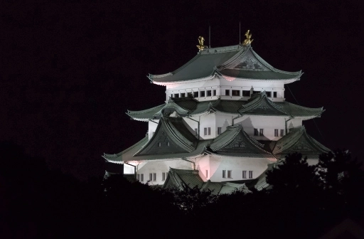
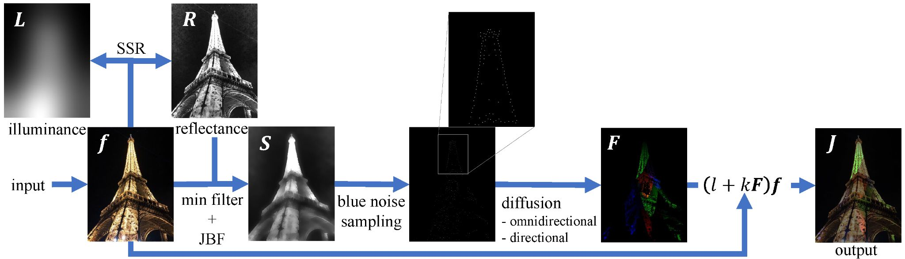
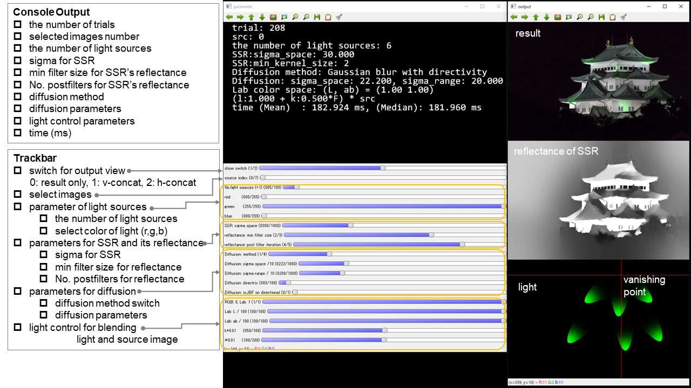

# Relighting Night Photography
 
[Web](https://norishigefukushima.github.io/RelightingUpNightPhotography/)



# Paper
* S. Oishi and N. Fukushima, "Retinex-Based Relighting for Night Photography," Applied Sciences, vol. 13, no. 3, 1719, 2023.
* [paper link](https://www.mdpi.com/2076-3417/13/3/1719)

```
@article{oishi2023retinex,
    author  = {Sou Oishi and Norishige Fukushima},
    title   = {Retinex-Based Relighting for Night Photography},
    journal = {Applied Sciences},
    volume  = {13},
    number  = {3},
    ARTICLE-NUMBER = {1719},
    year    = {2023},
    doi     = {10.3390/app13031719},
}
```

# Requirement

* [OpenCV with Qt build](https://opencv.org/)
* [OpenCP](https://github.com/norishigefukushima/OpenCP)
* Visual Studio 2022


`Relighting.sln` is a solution file of Visual Studio for our project.

# Description
## Shortcut
* `q` quit
* `p` push rendering output
* `s` same rendering outputs as WebP animation
## GUI

